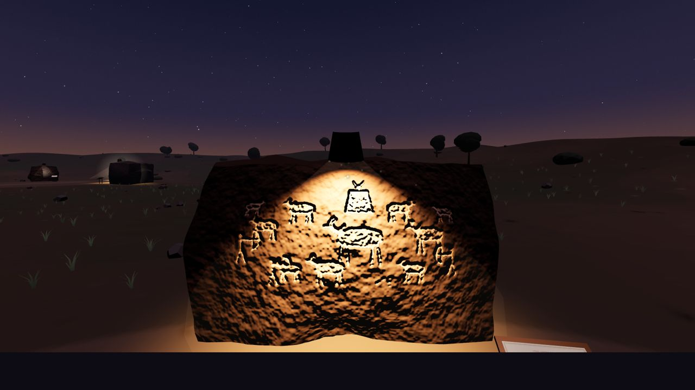
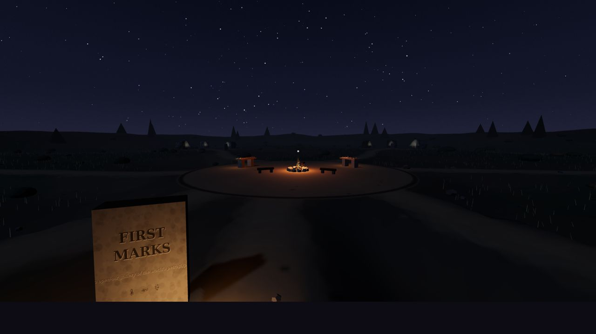
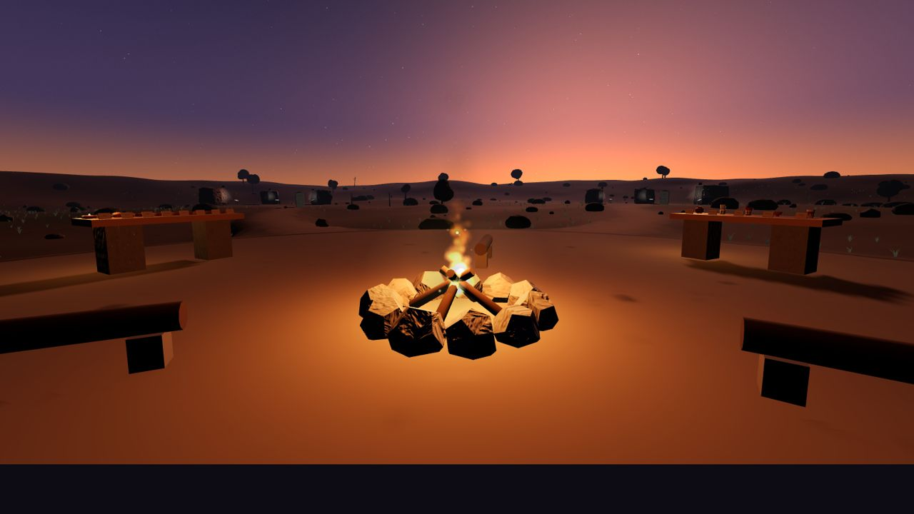
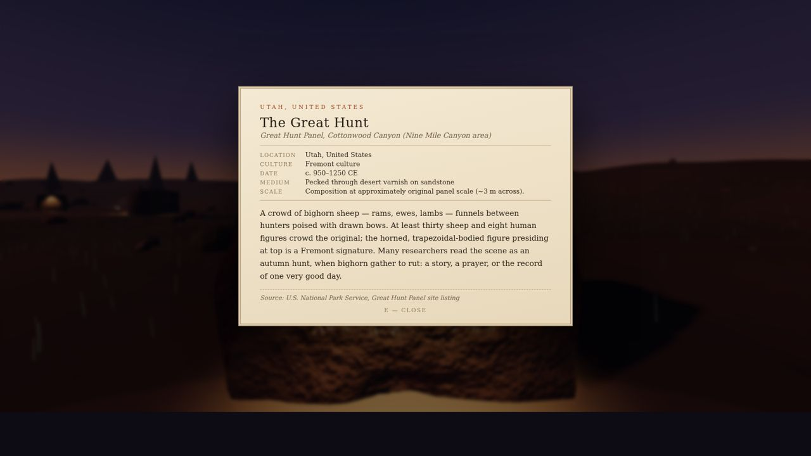
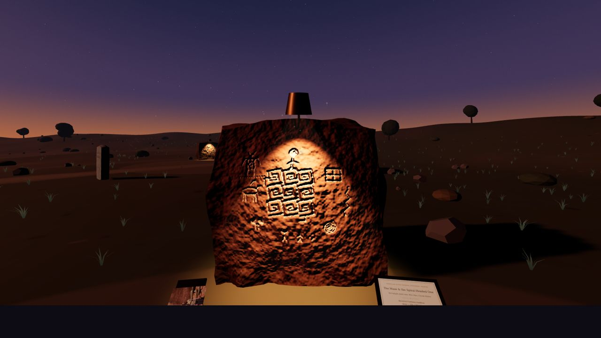

# FIRST MARKS 🪨

*an open-air gallery of the world's petroglyphs*

**Visit: [gallery.brezgis.com](https://gallery.brezgis.com)**



A walkable three.js gallery at perpetual dusk. Twenty-one real petroglyphs —
hand-redrawn stroke-by-stroke as thousands of peck marks, at (or near)
published scale — stand on procedurally shaped boulders in six regional
groves, each with a brass gallery sconce and a fact-checked museum label
whose sources are clickable. A seventh grove, **Field Notes**, holds two
panels the curator encountered in person in the Vermilion Cliffs of Arizona,
with her field photographs framed beside them.

At the center: a fire, log benches you can sit on, a pottery bar pouring five
archaeologically attested drinks (9,000-year-old Jiahu rice-honey wine, Chaco
canyon cacao, chicha de jora, pulque, Wari chicha de molle), and a table of
founding foods with info cards. The score — wooden flute, wind, crickets,
fire — is generated live in WebAudio. Nothing is sampled, no asset files
exist: every texture is drawn in code, every sound synthesized, and the whole
gallery ships as **one self-contained HTML file**.

| | |
|---|---|
|  |  |
|  |  |

## Quickstart

```bash
git clone https://github.com/brezgis/petroglyph-gallery
cd petroglyph-gallery
npm install
npm run dev        # build + serve on http://localhost:8123
```

No build needed just to *visit*: open `docs/index.html` in any browser —
that single file is the entire gallery. `npm run dist` regenerates it.

## Controls

WASD + mouse to walk (Shift or double-tap **W** to run) · **E** read labels /
take pottery / sip / sit by the fire · **G** set a vessel down · **N** dusk ⇄
night · **M** mute · **Q** performance mode · Esc frees the cursor.

Worth waiting for: the Sun Dagger returns to the Fajada spiral every few
minutes, shooting stars only fall at night, and there are lizards.

## The collection

- **North America** — the Great Hunt (Nine Mile Canyon) · the Fajada Butte Sun
  Dagger spiral · Three Rivers · the Sand Island flute players
- **South America** — the Toro Muerto dancers · the Atacama llama caravan ·
  the 42-metre serpent of the Orinoco
- **Europe** — Tanum's bronze ships · the Camunian Rose · Alta's reindeer corral
- **Africa** — the Dabous giraffes at their full 5.4 m · the Lion Man of
  Twyfelfontein · the Ice Age aurochs of Qurta
- **Asia** — Tamgaly's sun-headed beings · Gobustan's reed boats · the
  Bangudae whale hunt
- **Oceania** — the Murujuga thylacine · the Emu in the Sky, underfoot ·
  the birdmen of Orongo
- **Field Notes** — the Maze Rock Art Site & an unrecorded herd, Vermilion
  Cliffs, Arizona

## Honesty & ethics

The engravings are respectful hand redrawings after the originals — not
tracings — with sources on every lectern (UNESCO listings, NPS/BLM pages,
journal DOIs; every label was fact-checked and every link fetch-verified).
The originals belong to their landscapes and to the living peoples whose
heritage they are. The location of the one formally unrecorded panel is
deliberately withheld, per rock-art ethics. If you ever stand before the
real thing: never touch, chalk, or make rubbings.

## Tech notes

Plain JavaScript + [three.js](https://threejs.org), bundled with esbuild.
Terrain, sky, boulders, pottery and ground are procedural (fBm value noise +
canvas textures); petroglyphs render as thousands of jittered peck-dots along
authored polylines, embossed into normal maps so the sconce light catches the
grooves. Performance architecture: only the 6 nearest sconce spotlights are
live lights (constant count → no shader rebuilds), shadows re-bake only while
the light moves, resolution adapts to frame time, and raycasts hit invisible
proxy boxes. Grass/terrain techniques after
[al-ro](https://al-ro.github.io/projects/grass/) and the
[Codrops grass tutorial](https://tympanus.net/codrops/2025/02/04/how-to-make-the-fluffiest-grass-with-three-js/).

Built by [Claude](https://claude.com/claude-code), with full creative control,
for Anna — who then walked into the desert and brought back two more stones.
